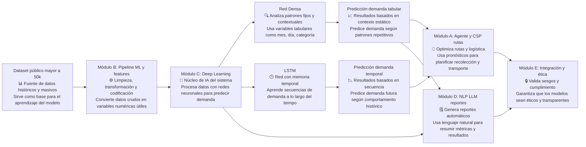

# Guía y Documentación Técnica del Módulo C (Deep Learning)

## 1. Propósito del módulo

El Módulo C tiene la responsabilidad de generar pronósticos de demanda a partir de datos de ventas procesados, utilizando modelos de aprendizaje profundo orientados a dos perspectivas complementarias:

- Modelado tabular (patrones contextuales por fecha y categoría).
- Modelado temporal (dinámica secuencial de la demanda).

Este módulo produce predicciones y métricas que se consumen en la toma de decisiones operativas (ruteo y priorización), en la generación de reportes y en la integración final del sistema.

## 2. Alcance funcional

El módulo cubre el ciclo completo de modelado:

1. Recepción de datos transformados desde etapas previas.
2. Escalado y preparación de entradas para aprendizaje supervisado.
3. Entrenamiento de modelos de red neuronal.
4. Inferencia (predicción) en escala original de negocio.
5. Evaluación cuantitativa mediante métricas de regresión.
6. Exposición de resultados para módulos consumidores.

## 3. Entradas del módulo C

### 3.1 Entradas provenientes del Módulo B

El Módulo B actúa como proveedor principal de datos preparados. El flujo esperado hacia C incluye:

- DataFrame transaccional procesado.
- Variables predictoras tabulares ya codificadas.
- Serie temporal de demanda total para modelado secuencial.

Campos de referencia esperados:

- Date_of_Sale
- Product_Category
- Sales_Amount
- Mes
- DiaSemana
- Categoria_Codificada
- DemandaTotal

### 3.2 Estructura de entrada para la red densa

Formato:

- X tabular: matriz de tamaño (n_muestras, n_features)
- y objetivo: vector de demanda (n_muestras,)

Características típicas:

- Mes
- DiaSemana
- Trimestre (si está disponible en preprocessing)
- Categoria_Codificada

### 3.3 Estructura de entrada para el bloque temporal (LSTM)

Formato:

- Serie unidimensional de demanda ordenada cronológicamente.
- Ventanas temporales (por defecto 7 pasos) para construir pares secuencia-objetivo.

Resultado de la preparación temporal:

- X_temporal: (n_muestras, ventana)
- y_temporal: (n_muestras,)

## 4. Proceso interno del módulo C

## 4.1 Escalado y normalización

Se aplica MinMaxScaler para estabilizar entrenamiento y mantener magnitudes comparables:

- En red densa: escalado de X y y.
- En bloque temporal: escalado de la serie antes de crear secuencias.

Durante inferencia, las predicciones se transforman de vuelta a la escala original para mantener interpretabilidad de negocio.

## 4.2 Entrenamiento del modelo tabular (Red Neuronal Densa)

Implementación actual:

- Clase principal: RedNeuronalDensa.
- Backend: MLPRegressor (scikit-learn) con activación ReLU y optimización Adam.
- Configuración base: capas ocultas (128, 64, 32), regularización L2 y early stopping.

Flujo:

1. Construcción del modelo.
2. Escalado de datos de entrada y objetivo.
3. Ajuste del modelo sobre datos de entrenamiento.
4. Predicción desescalada para uso operativo.

## 4.3 Entrenamiento del modelo temporal (RedLSTM)

Implementación actual:

- Clase principal: RedLSTM.
- En código, el componente temporal se aproxima con MLPRegressor sobre ventanas de serie temporal.
- Se conserva nomenclatura funcional de LSTM por su rol en modelado secuencial.

Flujo:

1. Escalado de serie de demanda.
2. Construcción de secuencias con ventana temporal.
3. División temporal train/test sin barajado (shuffle=False).
4. Entrenamiento del modelo temporal.
5. Predicción y desescalado.

## 4.4 Entrenamiento combinado (Ensemble opcional)

La clase EnsembleRedNeuronal permite combinar ambos enfoques:

- Red densa para patrón tabular.
- Modelo temporal para dependencia secuencial.

La inferencia puede fusionar predicciones mediante pesos configurables, siempre que se disponga de secuencias temporales para el componente temporal.

## 4.5 Evaluación de desempeño

La evaluación se realiza con métricas de regresión:

- MSE
- MAE
- RMSE
- R2

Reglas de evaluación:

- Modelos con método obtener_predicciones_y_reales usan su bloque de evaluación interno.
- Modelos con método predecir usan el conjunto de prueba tabular.
- Modelos tradicionales usan predict.

Esto permite comparar en un único reporte modelos ML clásicos y modelos del módulo Deep Learning.

## 5. Salidas generadas por el módulo C

### 5.1 Artefactos de modelo

- Modelo entrenado RedNeuronalDensa.
- Modelo entrenado RedLSTM (temporal).
- Configuración de EnsembleRedNeuronal (cuando se habilita).

### 5.2 Predicciones

- Predicción tabular de demanda.
- Predicción temporal de demanda.
- Predicción combinada (ensemble, opcional).

### 5.3 Métricas y reporte

- MSE, MAE, RMSE, R2 por modelo.
- Reporte comparativo de desempeño para validación técnica y seguimiento.

## 6. Destino de salidas por módulo consumidor

### 6.1 Salidas para Módulo A (Agente y CSP)

Consumo principal:

- Pronóstico de demanda por categoría y periodo.

Uso funcional:

- Priorización de recolección, reposición o picking.
- Soporte a decisiones de ruteo y restricciones en motores de búsqueda/CSP.

### 6.2 Salidas para Módulo D (NLP/Reportes)

Consumo principal:

- Predicciones consolidadas.
- Métricas de desempeño por modelo.

Uso funcional:

- Generación de reportes automáticos en lenguaje natural para perfiles técnicos y de negocio.

### 6.3 Salidas para Módulo E (Integración y ética)

Consumo principal:

- Modelos entrenados.
- Predicciones finales.
- Métricas de evaluación.

Uso funcional:

- Integración extremo a extremo del pipeline.
- Trazabilidad de resultados y verificación de sesgos/criterios éticos.

## 7. Contratos de datos recomendados

Para fortalecer interoperabilidad entre módulos, se recomienda documentar por cada intercambio:

- Nombre del payload.
- Formato (DataFrame, arreglo, JSON).
- Campos obligatorios.
- Frecuencia de actualización.
- Responsable emisor y responsable consumidor.

Ejemplo B -> C:

- Payload: demanda_procesada
- Formato: DataFrame
- Campos mínimos: Date_of_Sale, Product_Category, Sales_Amount, Mes, DiaSemana, Categoria_Codificada, DemandaTotal

Ejemplo C -> A:

- Payload: pronostico_demanda
- Formato: DataFrame
- Campos sugeridos: fecha, categoria, demanda_predicha, modelo_origen

Ejemplo C -> D:

- Payload: metricas_modelado
- Formato: JSON/DataFrame
- Campos sugeridos: modelo, MSE, MAE, RMSE, R2

## 8. Diagrama de proceso detallado del módulo C

Bloque copiado del diagrama detallado existente:

## 9. Referencias de implementación

- src/ml/deep_learning.py
- src/ml/train.py
- src/ml/evaluate.py
- docs/guia_diagrama_procesos_modulo_c.md
- docs/deep Learning.md

## 10. Nota técnica de consistencia

La documentación funcional mantiene el término LSTM para representar el modelado temporal del módulo. La implementación vigente en código usa una aproximación temporal con MLPRegressor sobre ventanas de serie, preservando la finalidad de pronóstico secuencial.
