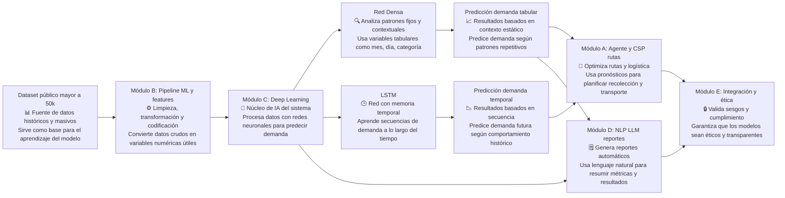

# 🧠 Diagrama Detallado del Flujo del Módulo C (Deep Learning)

```mermaid
flowchart LR
    A[Dataset público mayor a 50k\n📊 Fuente de datos históricos y masivos\nSirve como base para el aprendizaje del modelo] --> B[Módulo B: Pipeline ML y features\n⚙️ Limpieza, transformación y codificación\nConvierte datos crudos en variables numéricas útiles]
    B --> C[Módulo C: Deep Learning\n🧩 Núcleo de IA del sistema\nProcesa datos con redes neuronales para predecir demanda]
    C --> D[Red Densa\n🔍 Analiza patrones fijos y contextuales\nUsa variables tabulares como mes, día, categoría]
    C --> E[LSTM\n🕒 Red con memoria temporal\nAprende secuencias de demanda a lo largo del tiempo]
    D --> F[Predicción demanda tabular\n📈 Resultados basados en contexto estático\nPredice demanda según patrones repetitivos]
    E --> G[Predicción demanda temporal\n📉 Resultados basados en secuencia\nPredice demanda futura según comportamiento histórico]
    F --> H[Módulo A: Agente y CSP rutas\n🚚 Optimiza rutas y logística\nUsa pronósticos para planificar recolección y transporte]
    G --> H
    C --> I[Módulo D: NLP LLM reportes\n🗒️ Genera reportes automáticos\nUsa lenguaje natural para resumir métricas y resultados]
    F --> I
    H --> J[Módulo E: Integración y ética\n🔒 Valida sesgos y cumplimiento\nGarantiza que los modelos sean éticos y transparentes]
    I --> J
```
