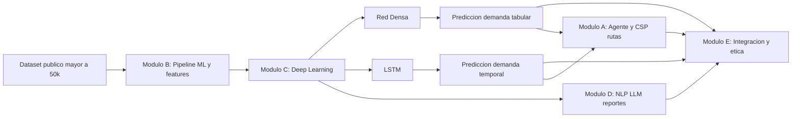

# Guia de procesos del modulo C (Deep Learning)

## Objetivo

Explicar de principio a fin la operacion del modulo C (Deep Learning), identificar entradas y salidas, y detallar la interaccion con los modulos A, B, D y E.

## 1) Entradas del modulo C

Recibir los siguientes tipos de entrada:

1. Recibir dataset transaccional procesado por el pipeline de datos.
   Considerar como campos minimos esperados:

- Date_of_Sale
- Product_Category
- Sales_Amount

2. Recibir features tabulares para red densa (desde preprocessing/modulo B):

- Mes
- DiaSemana
- Categoria_Codificada

3. Recibir serie temporal de demanda (para LSTM):

- Vector unidimensional con DemandaTotal ordenada por tiempo.

## 2) Transformaciones internas del modulo C

Ejecutar el siguiente flujo interno:

1. Realizar escalado de datos

- MinMaxScaler para X y y en la red densa.
- MinMaxScaler para la serie en LSTM.

2. Entrenar red neuronal densa

- Entrada: matriz tabular (n_muestras, n_features).
- Arquitectura: Dense + BatchNorm + Dropout + Dense final lineal.
- Salida: prediccion de demanda en escala original.

3. Entrenar red LSTM

- Entrada: secuencias (n_muestras, ventana_temporal, 1).
- Se crean secuencias con ventana temporal (por defecto 7).
- Split temporal train/test sin barajado para respetar serie.
- Salida: prediccion de demanda en escala original.

4. Ejecutar evaluacion

- Metricas: MSE, MAE, RMSE, R2.
- La evaluacion de LSTM usa su propio bloque de validacion/prueba almacenado.

5. Aplicar ensemble (opcional)

- Combina salida de red densa y LSTM cuando se proporcionan secuencias LSTM en inferencia.

## 3) Salidas del modulo C

1. Generar modelos entrenados:

- RedNeuronalDensa
- RedLSTM

2. Generar predicciones:

- Prediccion tabular (red densa).
- Prediccion temporal (LSTM).
- Prediccion combinada (ensemble, opcional).

3. Reportar metricas de desempeno:

- MSE
- MAE
- RMSE
- R2

## 4) Interaccion con modulos A, B, D y E

Definir interacciones segun la arquitectura del proyecto:

1. Conectar Modulo B -> Modulo C

- B entrega dataset transformado y features de demanda.
- C consume esas features y entrena red densa/LSTM.

2. Conectar Modulo C -> Modulo A

- C entrega pronostico de demanda por categoria/periodo.
- A usa esa demanda pronosticada para priorizar rutas de recoleccion con busqueda/CSP.

3. Conectar Modulo C -> Modulo D

- C entrega resultados y metricas.
- D genera resumen/reportes en lenguaje natural para stakeholders.

4. Conectar Modulo C -> Modulo E

- C entrega modelos, predicciones y metricas para integracion.
- E centraliza pipeline final y revisa sesgos/etica sobre predicciones.

## 5) Diagrama de procesos sugerido (vista general)

Copiar este bloque en Mermaid Live Editor o en Markdown compatible:

## 6) Guia paso a paso para construir el diagrama final

1. Definir alcance del diagrama: extremo a extremo (datos -> decision).
2. Dibujar primero los bloques A, B, C, D y E.
3. Agregar entradas de C:

- features tabulares
- serie temporal de demanda

4. Agregar procesos internos de C:

- escalado
- entrenamiento densa
- entrenamiento LSTM
- evaluacion
- ensemble opcional

5. Agregar salidas de C:

- predicciones
- metricas
- modelos entrenados

6. Conectar C con A, D y E segun las dependencias anteriores.
7. Validar con el equipo que cada flecha tenga contrato de datos claro.

## 7) Contratos de datos recomendados para documentar

Para cada flecha del diagrama, documentar:

- Nombre del payload
- Formato (DataFrame, vector, JSON)
- Campos obligatorios
- Frecuencia de actualizacion
- Responsable del modulo origen

Ejemplo rapido C -> A:

- Payload: pronostico_demanda
- Formato: DataFrame
- Campos: fecha, categoria, demanda_predicha
- Uso en A: priorizar picking y plan de ruta

## 8) Referencias de implementacion (codigo actual)

- src/ml/deep_learning.py
- src/ml/train.py
- src/ml/evaluate.py
- docs/arquitectura.txt
- docs/asignacion_modulos.md
