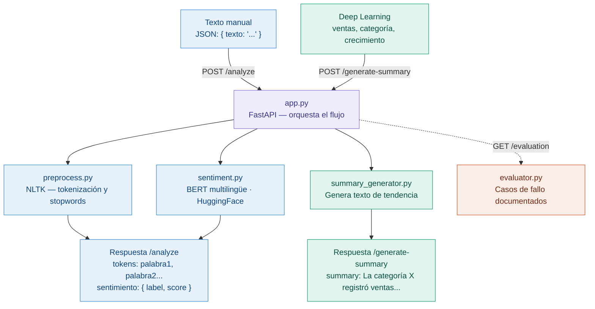

# Documentación del Proyecto NLP / LLM Integrado

## Descripción General

Microservicio de Procesamiento de Lenguaje Natural (NLP) construido con **FastAPI**, que integra análisis de sentimientos mediante un modelo LLM preentrenado y generación automática de resúmenes a partir de datos de predicciones de ventas.

---

## Estructura del Proyecto

```
nlp/
├── app.py                  # Servidor FastAPI — define rutas y orquesta el flujo
├── preprocess.py           # Preprocesamiento y tokenización de texto
├── sentiment.py            # Análisis de sentimientos con modelo BERT multilingüe
├── summary_generator.py    # Generación de resúmenes de ventas
├── evaluator.py            # Casos de fallo / evaluación del modelo
├── requirements.txt        # Dependencias del proyecto
```

## Diagrama de flujo- NLP



---

## Endpoints de la API

| Método | Ruta               | Descripción                                                       |
|--------|--------------------|-------------------------------------------------------------------|
| `GET`  | `/`                | Health check — confirma que el servicio está corriendo            |
| `POST` | `/analyze`         | Recibe texto manual, lo tokeniza y devuelve análisis de sentimiento |
| `POST` | `/generate-summary`| Recibe datos de ventas (desde Deep Learning) y genera un resumen  |
| `GET`  | `/evaluation`      | Devuelve casos de fallo documentados del modelo                   |

---

## Módulos

### `app.py` — Servidor Principal
Orquesta toda la aplicación. Define dos modelos de entrada con Pydantic:

- **`ReviewRequest`**: recibe `texto: str` para el flujo manual (`/analyze`).
- **`SalesPredictionRequest`**: recibe `ventas_totales: int`, `categoria_top: str`, `crecimiento: float` para el flujo de Deep Learning (`/generate-summary`).

**Flujo `/analyze`:**
1. Recibe texto → `preprocess_text()` → tokenización
2. Texto original → `analyze_sentiment()` → sentimiento con score
3. Devuelve: texto original, tokens y sentimiento

**Flujo `/generate-summary`:**
1. Recibe datos de ventas → `generate_sales_summary()` → resumen en lenguaje natural
2. Devuelve: cadena de texto descriptiva con tendencia y porcentaje

---

### `preprocess.py` — Preprocesamiento de Texto
Utiliza **NLTK** para limpiar y tokenizar texto en español.

**Pasos del pipeline:**
1. Convertir texto a minúsculas
2. Eliminar caracteres especiales (conserva acentos y ñ)
3. Tokenizar con `word_tokenize`
4. Eliminar *stopwords* en español

**Librerías:** `nltk`, `re`

---

### `sentiment.py` — Análisis de Sentimientos
Usa el modelo preentrenado de HuggingFace:

```
nlptown/bert-base-multilingual-uncased-sentiment
```

- Modelo: **BERT multilingüe** entrenado para clasificación de sentimientos en múltiples idiomas (incluye español).
- Pipeline: `transformers.pipeline("sentiment-analysis")`
- Salida: `{ "label": "...", "score": float }`

---

### `summary_generator.py` — Generación de Resúmenes
Genera resúmenes en lenguaje natural a partir de datos numéricos de ventas.

**Lógica de tendencia:**
- `crecimiento > 0` → `"crecimiento"`
- `crecimiento < 0` → `"disminución"`
- `crecimiento == 0` → `"estabilidad"`

**Ejemplo de salida:**
```
"La categoría Electronics registró ventas estimadas de 250000 unidades con una tendencia de disminución del 5%."
```

---

### `evaluator.py` — Evaluación y Casos de Fallo
Documenta casos donde el modelo puede fallar, especialmente con:

| Caso | Problema |
|------|----------|
| `"Este producto está mortal"` | Jerga positiva mal interpretada como negativa |
| `"Excelente servicio... nunca llegó el pedido"` | Sarcasmo genera errores de clasificación |

Accesible vía `GET /evaluation`.

---

## Dependencias (`requirements.txt`)

| Librería       | Uso principal                                    |
|----------------|--------------------------------------------------|
| `fastapi`      | Framework web para la API REST                   |
| `uvicorn`      | Servidor ASGI para correr FastAPI                |
| `transformers` | Modelo BERT para análisis de sentimientos         |
| `torch`        | Backend de PyTorch para el modelo LLM            |
| `sentencepiece`| Tokenizador del modelo BERT multilingüe          |
| `nltk`         | Tokenización y stopwords en español              |
| `scikit-learn` | Utilidades de ML (disponible para extensión)     |

---

## Cómo Probar el Proyecto

### Iniciar el servidor
```bash
uvicorn app:app --reload
```
Disponible en: `http://127.0.0.1:8000`

Documentación Swagger: `http://127.0.0.1:8000/docs`

---

### Flujo 1 — Análisis NLP manual (`POST /analyze`)
Entrada esperada:
```json
{
  "texto": "El producto llegó en perfecto estado y me encantó"
}
```
Salida esperada:
```json
{
  "texto_original": "El producto llegó en perfecto estado y me encantó",
  "tokens": ["producto", "llegó", "perfecto", "estado", "encantó"],
  "sentimiento": {
    "label": "5 stars",
    "score": 0.87
  }
}
```

---

### Flujo 2 — Generación de resumen desde Deep Learning (`POST /generate-summary`)
Entrada esperada:
```json
{
  "ventas_totales": 250000,
  "categoria_top": "Electronics",
  "crecimiento": -5
}
```
Salida esperada:
```json
{
  "summary": "La categoría Electronics registró ventas estimadas de 250000 unidades con una tendencia de disminución del 5%."
}
```